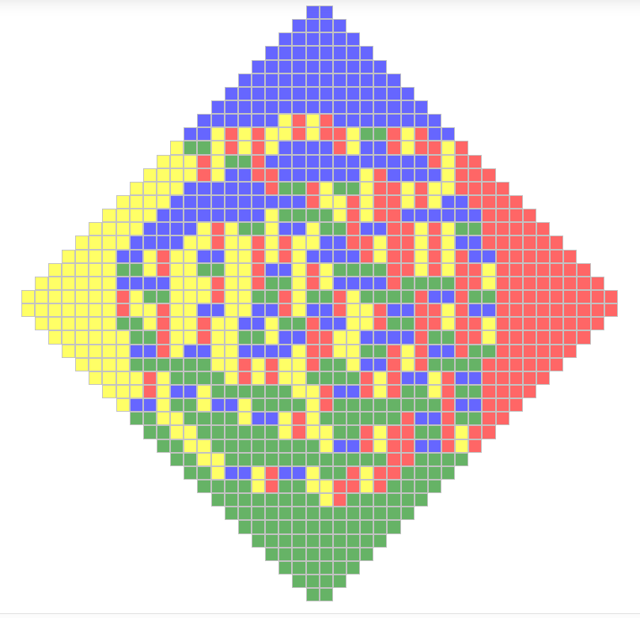

Sage Combinat Widgets
=======================

A collection of **interactive widgets** for the *Jupyter* notebook

- graphically represent

- edit graphically and get the modified value

- can be used as building blocks in applications

- available for

  - (until now only grid-representable) combinatorial objects
  - (until now only grid-representable) graphs
  - matrices
  - write your own

Editing a Young Tableau
=========================

1 image de tableau + 1 vidéo (lien)

Tossing Dominos
===============

	   
1 image de touillage + 1 vidéo (lien)

couplage ? (si j'y arrive : 1 image à mettre en-dessous ou à côté)

Using @interact
=================

1 image de products of Schur functions + vidéo (lien)

Your own widget: *Jeu de Taquin* example (1)
=============================================

1 image de jeu de taquin + vidéo

Your own widget: *Jeu de Taquin* example (2)
==============================================

.. code-block:: python
	
	def myfunc (arg1, arg2='foo'):
		global baz
		bar = unicode (quux)
		return 25

